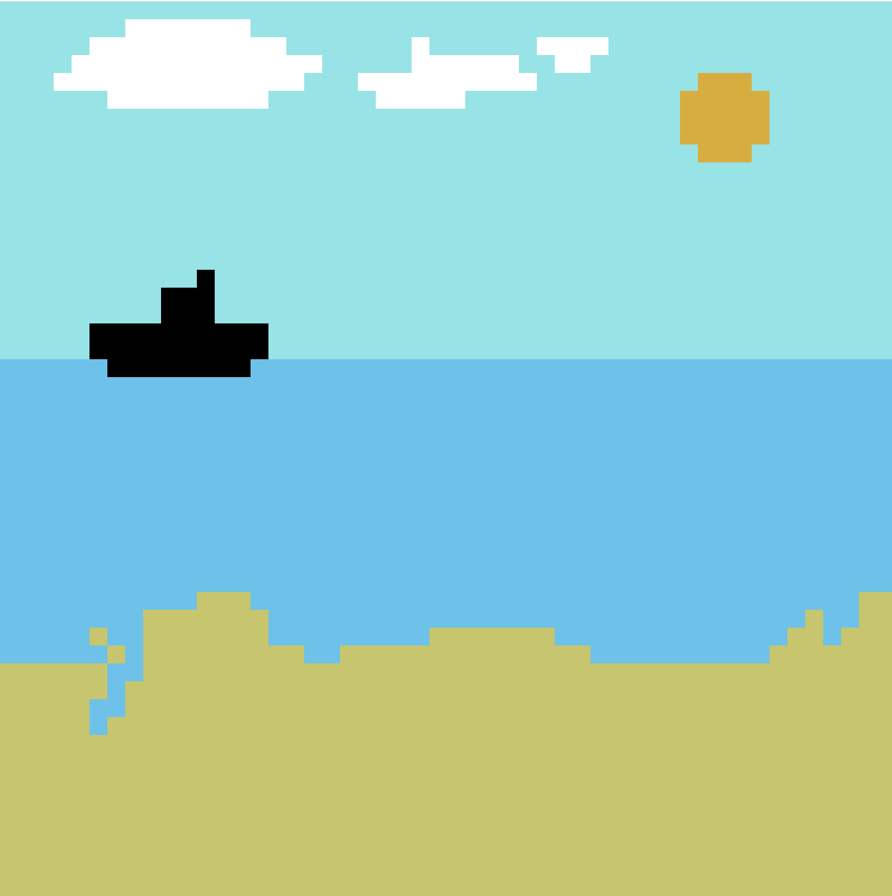
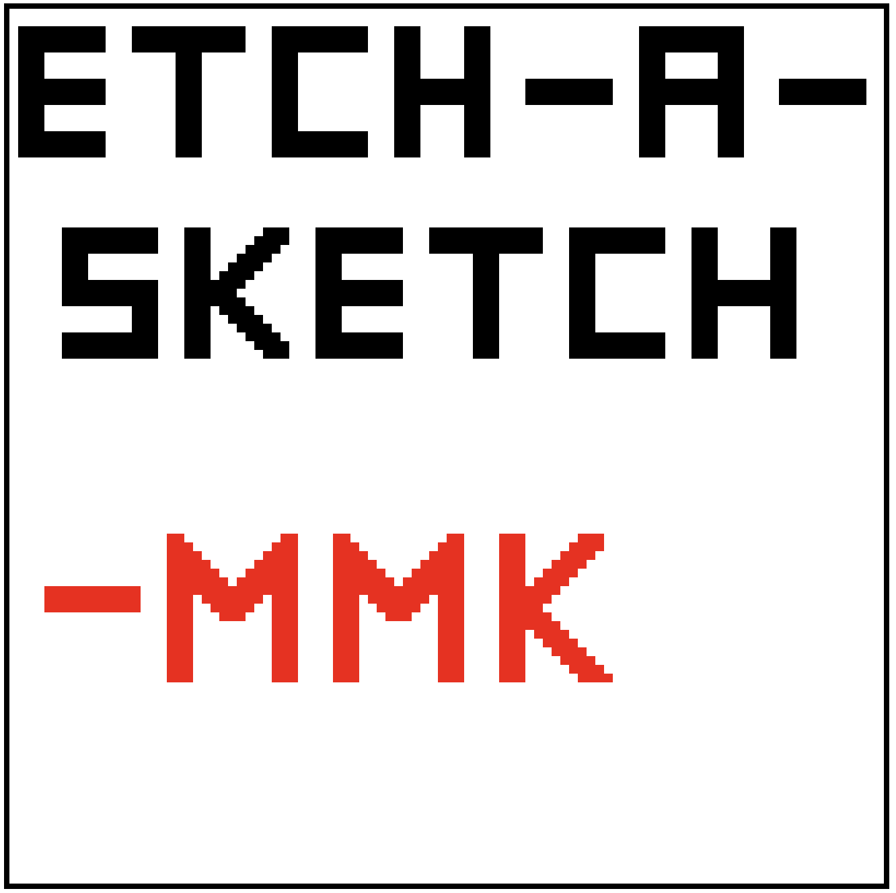

# TOP – Etch-A-Sketch

This project is part of the **Foundations course** from **The Odin Project**.  
It recreates a digital version of the classic Etch-A-Sketch toy, allowing users to draw by hovering over a grid.

## Features

- Adjustable grid size
- Draw by hovering over grid cells
- Multiple color modes (black, random colors, custom color)
- Progressive opacity drawing
- Erase mode and grid reset
- Optional grid borders

## How It Works

Move your cursor over the grid to draw.  
You can switch between drawing modes, change colors, toggle opacity effects, and erase or reset the canvas at any time.

## Gallery

